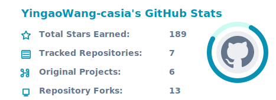
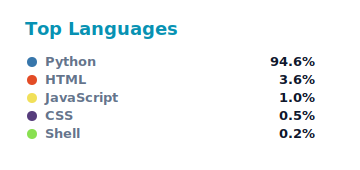

# Yingao Wang

  <a href="README.md">中文</a> ·
  <a href="README_EN.md"><strong>English</strong></a>

### 🎙️ Speech Signal Processing | Audio AI | Turn Detection | Full-duplex Interaction | LLM Agent Engineering

  <strong>Listening, waiting, interrupting and responding at the right moment.</strong>

  
  

  
  
  
  
  
  
  
  

---

## 👋 About Me

I studied Artificial Intelligence at Beijing University of Technology and am currently pursuing a master's degree in Pattern Recognition and Intelligent Systems at the Institute of Automation, Chinese Academy of Sciences.

My main research and engineering interests include VAD, conversational turn detection, full-duplex speech interaction, speech-interaction benchmarks, LLM agents, and practical RAG systems.

I care about the full path from algorithm modeling to engineering delivery: dataset construction, model training and evaluation, audio-processing pipelines, real-time interaction systems, intelligent document parsing, and open-source project maintenance.

---

## 🎓 Education

| Period | School / Institute | Major / Direction |
| --- | --- | --- |
| 2022.09 - 2026.07 | Beijing University of Technology | Artificial Intelligence, B.Eng. |
| 2026.09 - Present | Institute of Automation, Chinese Academy of Sciences | Pattern Recognition and Intelligent Systems, M.S. |

Research focus: speech-interaction foundation models, LLM applications, and LLM algorithms.

---

## 💼 Experience

### 🗣️ Bairong Cloud — Speech Algorithm Engineer

Period: 2025.12 - Present

I work on algorithms and systems for speech interaction, including turn detection, VAD, endpoint detection, and full-duplex speech interaction.

Main work:

1. Three-class turn detection model and system  
   Designed and evaluated turn-taking models for real human-machine voice interaction, deciding whether a user input is complete, still needs waiting, or should be treated as invalid.

2. VAD and endpoint detection optimization  
   Improved speech activity detection strategies for short utterances, weak speech, long pauses, noise, and non-semantic vocal sounds.

3. Full-duplex speech interaction exploration  
   Built modules for speech detection, turn judgment, interruption recognition, and response timing control to improve natural conversational fluency.

Keywords: VAD, Turn Detection, Full-duplex Interaction, Speech AI Benchmark, Real-time Speech Interaction

---

### 🧠 Bohua Xinzhi — Agent R&D Engineer

Period: 2025.09 - 2025.12

I participated in the design and development of an LLM-powered intelligent document agent, covering requirement analysis, technical solution design, and engineering implementation.

Projects:

1. Technical solution generation assistant  
   Built a document parsing, content splitting, module extraction, and technical proposal generation workflow based on LLMs and retrieval. The system supports multi-node parallel processing and reduces manual proposal writing from hours to minutes.

2. Intelligent tender-document parsing assistant  
   Designed a multi-path extraction pipeline for tender documents, combining DeepSeek-Chat, differentiated prompting, GTE vector retrieval, and reranking to extract parameters, parse structure, and build temporary knowledge bases.

Keywords: LLM Agent, RAG, GTE, Rerank, Document Parsing, Knowledge Base Construction

---

## 🧭 Research And Engineering

### 🎧 Speech AI / Audio Intelligence

- VAD and speech endpoint detection
- Three-class turn detection
- Multi-class full-duplex turn detection
- Benchmark construction for real speech-interaction scenarios
- Interruption recognition and response timing control
- Speech dataset construction, cleaning, annotation, and evaluation
- Long-audio segmentation, alignment, inference, and post-processing

### 🧩 LLM Agent / RAG Engineering

- LLM agent system development
- RAG knowledge-base construction and retrieval optimization
- Structured document parsing
- Multi-node task orchestration
- Prompt engineering
- Local AI toolchains and Codex Skill development
- AI engineering systems for project review, interview stress testing, and evidence-chain organization

---

## 🧰 Tech Stack

| Direction | Technologies |
| --- | --- |
| Programming & Engineering | Python, Bash, Linux, Git, Docker |
| Deep Learning | PyTorch, ONNX, Anaconda |
| Audio Processing | FFmpeg, VAD, Turn Detection, Full-duplex Interaction |
| LLM Engineering | LLM Agent, RAG, Prompt Engineering, GTE, Rerank |
| Platforms | Dify, RAGFlow |

---

## 🚀 Featured Open-source Projects

### 🎙️ Speech AI / Turn-taking

<table>
  <tr>
    <td width="50%" valign="top">
      <h3>
        <a href="https://github.com/Bairong-Xdynamics/TurnSense">
          🎧 TurnSense
        </a>
      </h3>
      

        A three-class turn detection model for real human-machine speech interaction. It classifies user input as
        <code>complete</code> / <code>incomplete</code> / <code>invalid</code>
        to decide whether the system should respond immediately, keep waiting, or ignore invalid input.
      

      

        <code>Turn Detection</code>
        <code>Speech AI</code>
        <code>VAD</code>
        <code>ONNX</code>
      

      

        
        
        
      

    </td>
    <td width="50%" valign="top">
      <h3>
        <a href="https://github.com/YingaoWang-casia/CoDeTT.github.io">
          🧪 CoDeTT Benchmark
        </a>
      </h3>
      

        A multi-class turn detection benchmark for full-duplex speech interaction, designed to evaluate Turn-Taking
        models on multi-scenario decision tasks. The project includes unified evaluation scripts for multiple models.
      

      

        <code>Benchmark</code>
        <code>Full-duplex</code>
        <code>Turn-taking</code>
        <code>Evaluation</code>
      

      

        
        
        
      

    </td>
  </tr>
</table>

---

### 🧩 LLM Agent / RAG / Codex Skill

<table>
  <tr>
    <td width="50%" valign="top">
      <h3>
        <a href="https://github.com/YingaoWang-casia/shushu-ProjectProof">
          🛠️ ProjectProof for Codex
        </a>
      </h3>
      

        A Codex Skill for AI / Agent / RAG / algorithm / data / frontend-backend internship projects.
        It does not fabricate experience; instead, it helps users bring real projects back to evidence chains,
        engineering boundaries, and interview follow-up questions.
      

      

        <code>Codex Skill</code>
        <code>Project Review</code>
        <code>Evidence Contract</code>
        <code>Interview</code>
      

      

        
        
        
      

    </td>
    <td width="50%" valign="top">
      <h3>
        <a href="https://github.com/YingaoWang-casia/shushu-InterviewProof-RAG">
          📚 InterviewProof-RAG
        </a>
      </h3>
      

        A Codex-first local interview-experience RAG and project stress-testing system. It turns scattered interview notes
        into traceable InterviewCards, then uses local indexing, Codex Packs, and ProjectProof Bridge to check whether
        personal projects can survive real interview follow-ups.
      

      

        <code>RAG</code>
        <code>Local Index</code>
        <code>InterviewCard</code>
        <code>Codex Pack</code>
      

      

        
        
        
      

    </td>
  </tr>
</table>

---

## 📈 Contribution Activity

---

## ⭐ GitHub Stats

---

## 🔭 Current Focus

- Three-class / multi-class turn detection for real speech interaction
- Interruption recognition and response timing control in full-duplex speech systems
- Speech-interaction benchmark construction and multi-model evaluation
- Robust VAD and semantic endpoint detection for low-resource scenarios
- Agent + RAG engineering for document intelligence and project review
- Codex Skill and local AI toolchain development

---

## 📬 Contact

- GitHub: @YingaoWang-casia
- Email: 2967523019@qq.com

> Focus on Speech AI, Turn-taking, Full-duplex Interaction and Practical LLM Agent Systems.

